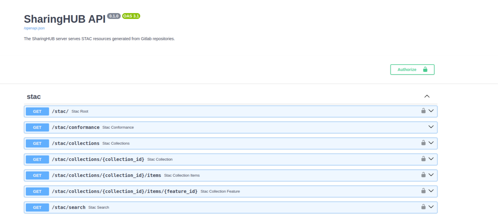

# STAC API

All projects on SharingHub are available in [STAC](https://stacspec.org) format as Collection, FeatureCollection or Feature, thanks to the STAC API. We are also compliant with [OGC API - Features - Part 1: Core](https://docs.ogc.org/is/17-069r3/17-069r3.html).

In other words, it is possible to interact with the SharingHub using any STAC client such as EODAG, QGIS STAC etc... You will find a list of clients [here](https://stacspec.org/en/about/tools-resources/#Visualization).
