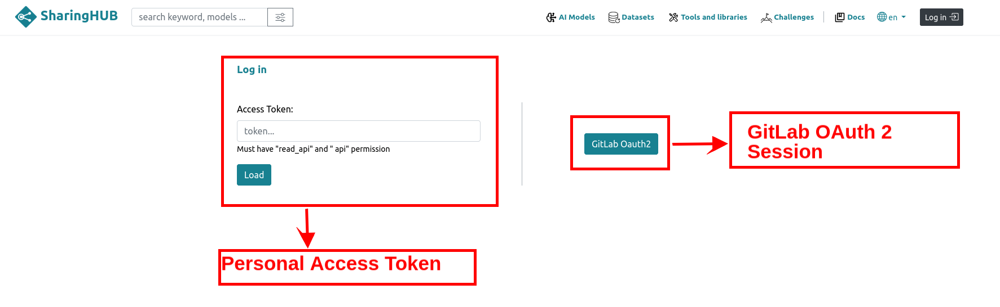

# Authentication

Various login options are available on SharingHub.

## GitLab OAuth 2 session

SharingHub is based on GitLab version (>=)15.11, to which the data is connected. Connection to SharingHub is done via the Oauth2
protocol, which will send you back to GitLab. Once you are connected to GitLab, you will be redirected to the connected SharingHub.

## Personal Access Token

The private access token connection mode lets you connect to sharing via an active access token from GitLab.
!!! note Info
    The token may not have the right rights. Check that the token is valid and has "api" scope. To see how it works [see more](https://docs.gitlab.com/ee/user/project/settings/project_access_tokens.html).

## Default token

In this case, you do not need to log in to view projects, models or datasets, but access is limited because collaboration and model inference features are disabled.

!!! note Warning
    Depending on the platform configuration, this mode can be deactivated in favor of the two options mentioned above.
