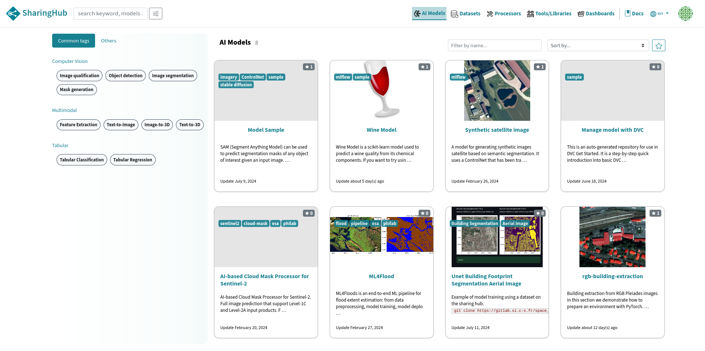
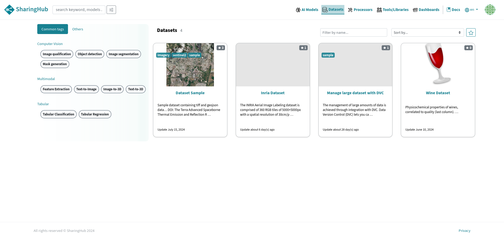
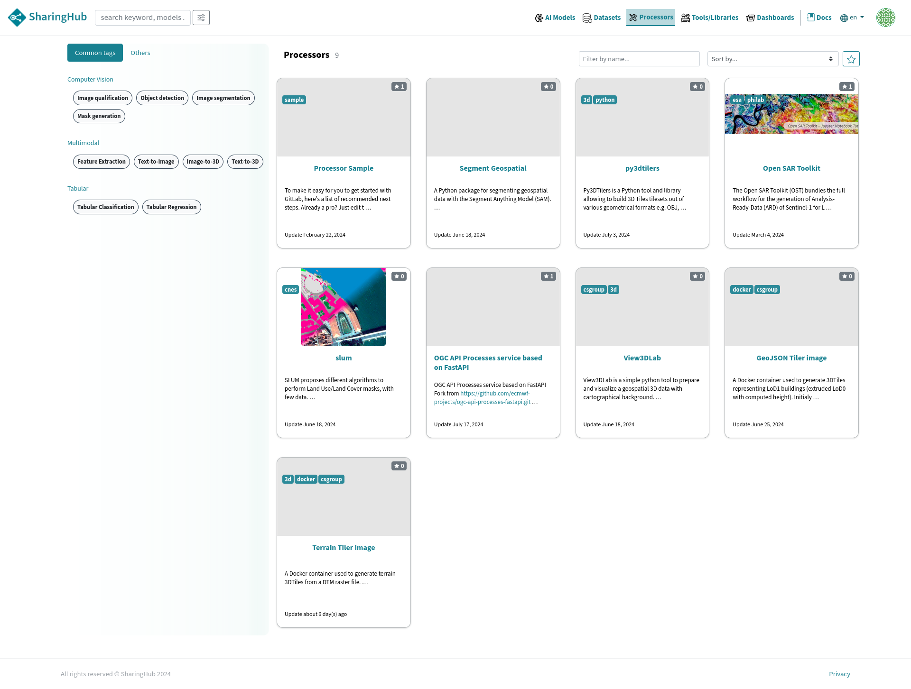
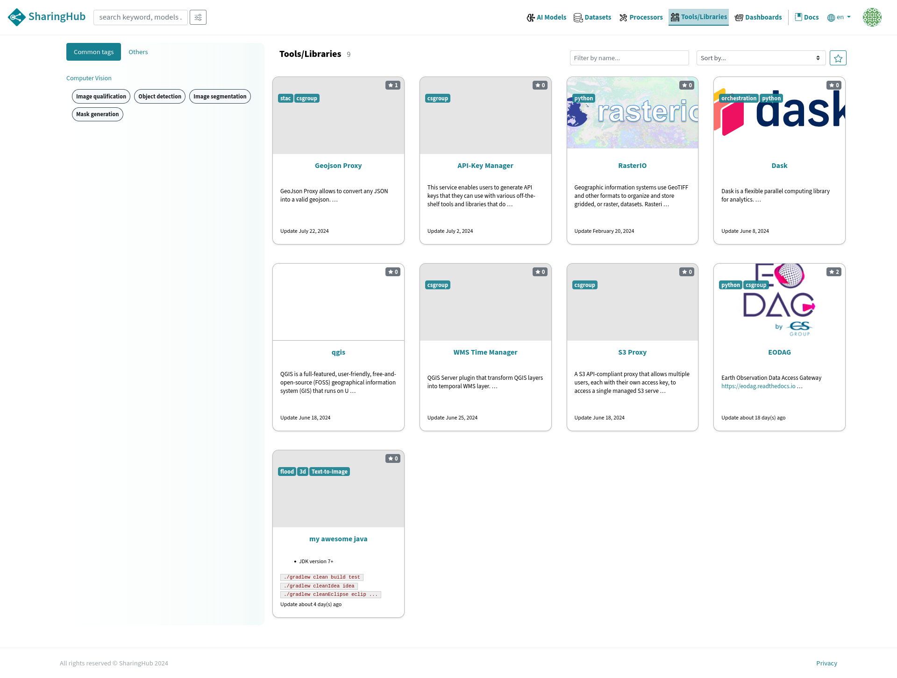
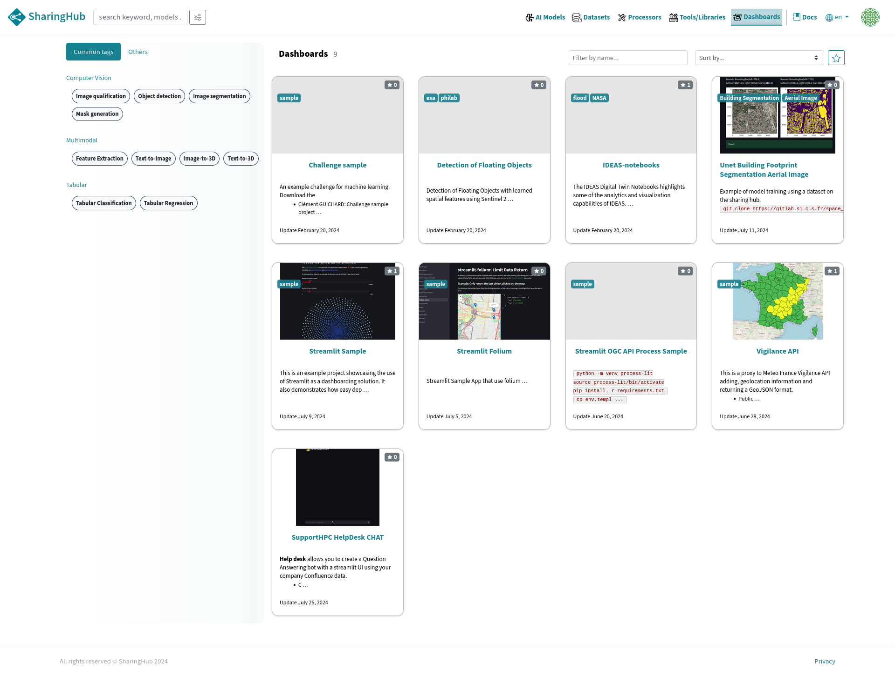

# Categories

The SharingHub is an online platform dedicated to sharing resources and tools in the field of artificial intelligence (AI). It offers users the possibility of sharing and accessing projects from several categories, including:

- AI models
- Datasets
- Processors
- Tools and libraries
- Dashboards

!!! warning
    Depending on your SharingHub configuration some categories may not be present for your instance.

## AI Models

All projects related to the AI models category are served by the SharingHub in the AI models section, using STAC API `collection_id: ai-model` metadata.



An example getting projects from AI models category using the STAC API:

```bash
curl https://sharinghub.example.com/api/stac/search?collections=ai-model&limit=100
```

## Datasets

Datasets category groups repositories where large volumes of data are stored for your AI model training. These data repositories are compatible with Git LFS and DVC, which ensures a large storage volume.

Datasets are served by the SharingHub in the "Datasets" section using STAC API `collection_id: dataset` metadata.



## Processors

Processors are projects generally containing external or internal libraries that you have written to improve the handling of your datasets, or to enhance the learning of your AI models.

All processors are served by SharingHub in "Processors" section using STAC API `collection_id: processor` metadata.



## Tools/Librairies

Tools and libraries are projects used by the developers of the platform, not necessarily AI-related.

All tools and librairies are served by SharingHub in "Tools/Librairies" section using STAC API `collection_id: tools` metadata.



## Dashboards

The Dashboard category is used to share demonstrations for models, with a tool like Streamlit to offer an interactive web interface to play around with a model inputs and check the predicted output.

All dashboards are served by SharingHub in "Dashboards" section using STAC API `collection_id: dashboard` metadata.


