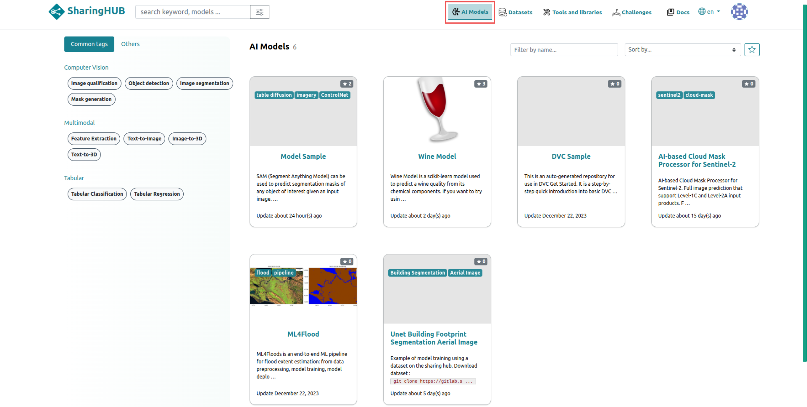
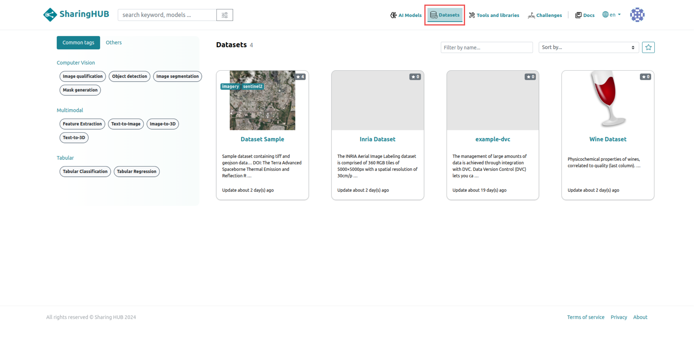
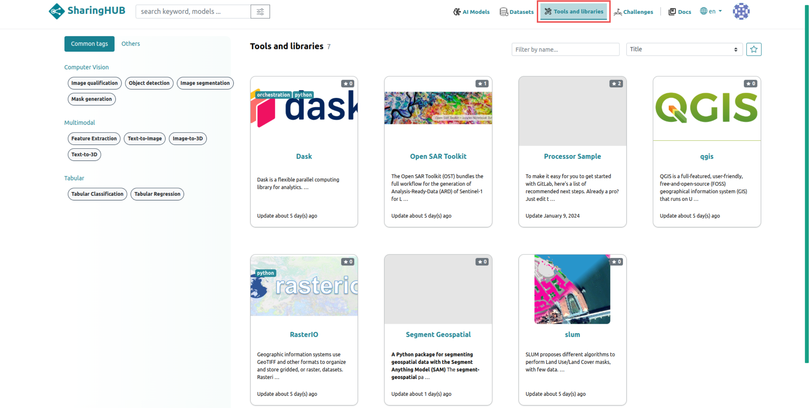
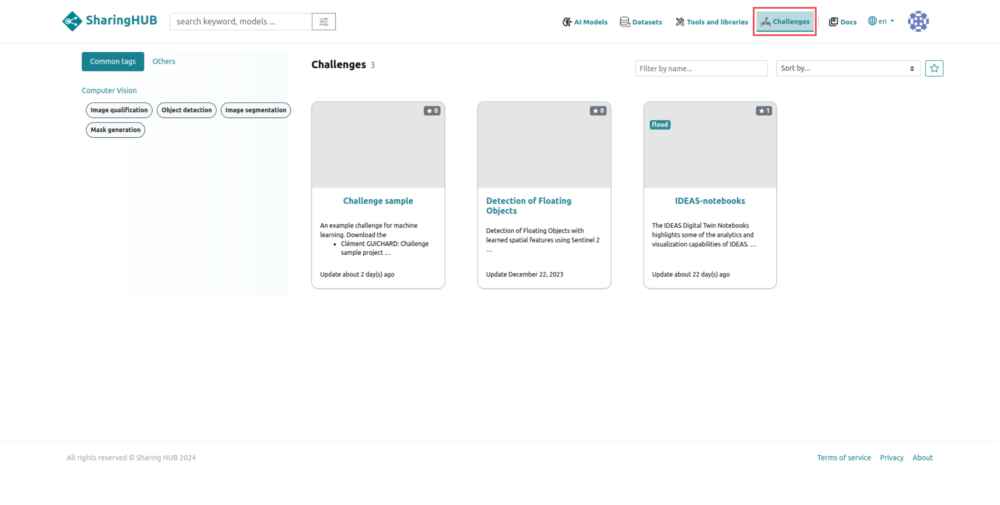

# Categories

The SharingHub is an online platform dedicated to sharing resources and tools in the field of artificial intelligence (AI). It offers users the possibility of sharing and accessing projects from several categories, including:

- AI models
- Datasets
- Tools and libraries
- Challenges

## AI Models

All projects related to the AI models category are served by the SharingHub in the AI models section, using STAC API `collection_id: ai-model` metadata.



An example getting projects from AI models category using the STAC API:

```bash
curl https://sharinghub.example.com/api/stac/search?collections=ai-model&limit=100
```

## Datasets

Datasets category groups repositories where large volumes of data are stored for your AI model training. These data repositories are compatible with Git LFS and DVC, which ensures a large storage volume.

Datasets are served by the SharingHub in the Datasets section using STAC API `collection_id: dataset` metadata.



## Tools and Librairies

Tools and libraries are projects generally containing external or internal libraries that you have written to improve the handling of your datasets, or to enhance the learning of your AI models.

All Tools and librairies are served by SharingHub in Tools and librairies section using STAC API `collection_id: processor` metadata.



## Challenges

The Challenges category is used to define a contest in the field of Machine Learning where researchers and data-scientists participate in order to solve specific problems, improve algorithms or achieve better performances on benchmark datasets. That category is used to provide ressources required to participate to the competition.

All challenges are served by SharingHub in Challenges section using STAC API `collection_id: challenge` metadata.


