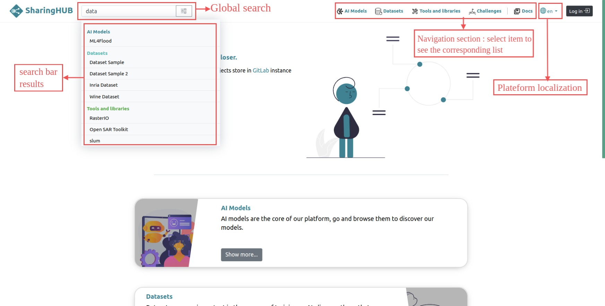

# Overview

SharingHub is a platform offering a collaborative portal based on GitLab for tracking and exchanging code, datasets and scientific models. Thanks to its interface, it promotes productivity, collaboration and efficient development in the field of AI and machine learning. It offers seamless integration with popular AI frameworks and libraries, streamlined data management capabilities and facilitates the sharing and reuse of AI models and geospatial datasets thanks to its compatibility with the STAC protocol.

The SharingHub home page presents the platform's various functionalities and navigation links to access them.
Users must log in to access all SharingHub features, although a restricted version is available if the user is not logged in.

<figure markdown>

</figure>
