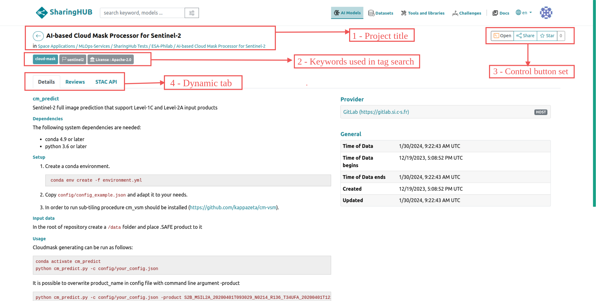
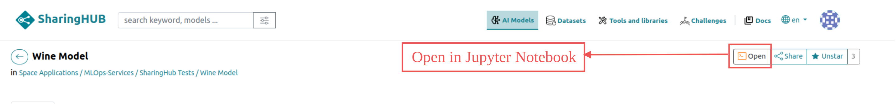
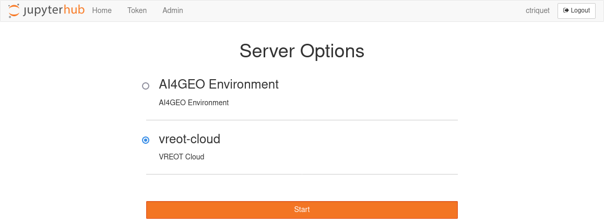
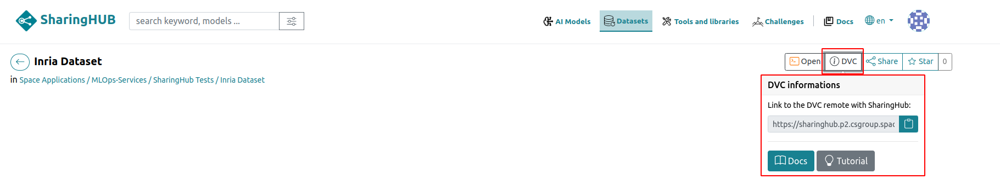
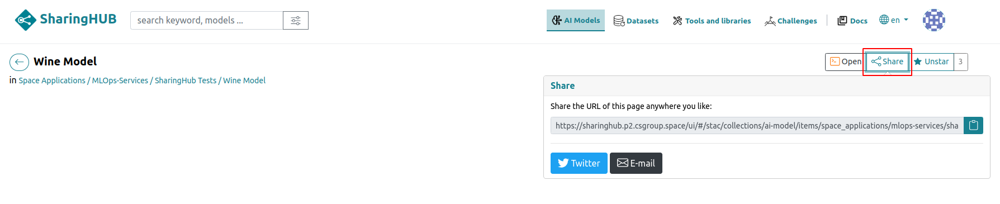
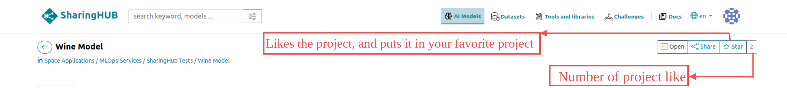
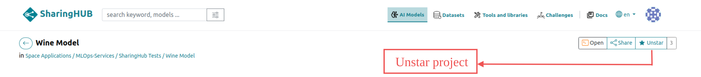
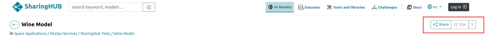
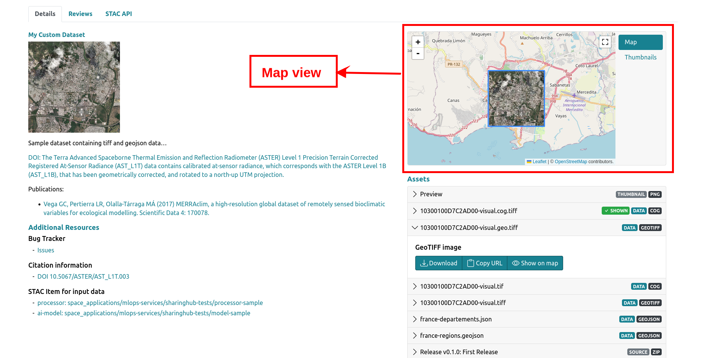
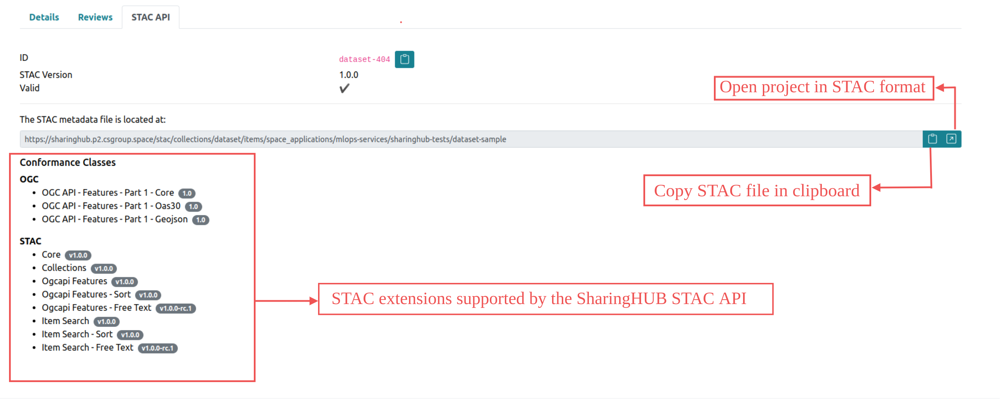

# Project view

The main SharingHub view, shown below, is designed to display as much metadata as possible about a project, whether it's an AI model, a dataset, a tool/library or a challenge.



## 1. Project title Section

This section is made up of the project's name as described in GitLab and a link that takes you directly to the repository where the project is hosted.

## 2. Keywords/Tags Section

This section displays all the keywords and licenses related to the project in GitLab. It's important because it's used as a label to filter out projects with common criteria or specifications. Moreover, tags are used to improve searches, as described in the [tag search section](./search.md#tag-search-tab).

## 3. Controls Button set

This important section allows you to interact with the project with the following functionalities:

### Open project in Jupyter Notebook

If the SharingHub is configured with a notebook service, this button will appear, allowing you to open the project, in particular your AI model in a notebook, for testing or manipulation in a dedicated environment.



When you click the open button, the Jupyter environment is launched to open the target Notebook.
Click on the "Launch Server" button.
At next page, select "vreot-cloud" environment and click on "Start" button.





!!! info
    **_Configure destination folder_**

    The project is cloned by default in your Jupyter environment home folder.
    If you prefer to customize that behaviour, it is required to set an environment variable into Jupyter.
    To do so, you have to initialize a user Jupyter configuration file.
    Into Jupyter, open a terminal and execute:

    ```bash
    jupyter notebook --generate-config
    vim ~/.jupyter/jupyter_notebook_config.py
    ```

    and add into that file:

    ```python
    import os
    os.environ["NBGITPULLER_PARENTPATH"] = "destination_folder"
    ```

    with "destination_folder" the relative path from your home folder where you want projects to be cloned.

    Finally, restart Jupyter for that configuration to be applied.

### Display DVC information

The DVC service enables you to store large volumes of data. The DVC button is therefore only displayed for projects in the "Datasets" category, which have a DVC configuration in the source GitLab project.  This button displays the remote DVC configuration link and additional information on the DVC [documentation](https://dvc.org/doc) and [tutorial](../tutorials/manage_dataset_with_dvc.md).



### Share the project

The share button lets you share a direct link to the project with other colleagues.



### Star the project

If you like the project, you will be able to star it and it will appear in your [favorite projects](./search.md#filter-by-starred-projects).




!!! Note Warning

    If the default token is enabled, filter by star button is not visible because we are in read-only mode.

    

## 4. Dynamics Tabs

This section displays details, comments and the STAC API in tabbed format.

### Details Tab

This "details" tab displays the project description first. This view highlights all the project's files and resources in the "assets" section, and thanks to the "additional resources" section it's possible to see references to other projects or resources.


In some cases, and more generally for datasets, the details tab may show a map with an area corresponding to the geographic extent of the dataset.



### Reviews Tab

This section is a discussion forum for the project, allowing contributors to leave notes and ask questions to each other.


### STAC API Tab

This section shows the STAC API informations of the project, the link to the STAC file of the project and also checks if the project is valid according to the supported STAC extensions.


