# Project view

The main SharingHub view, shown below, is designed to display as much metadata as possible about a project, whether it's an AI model, a dataset, or another category.

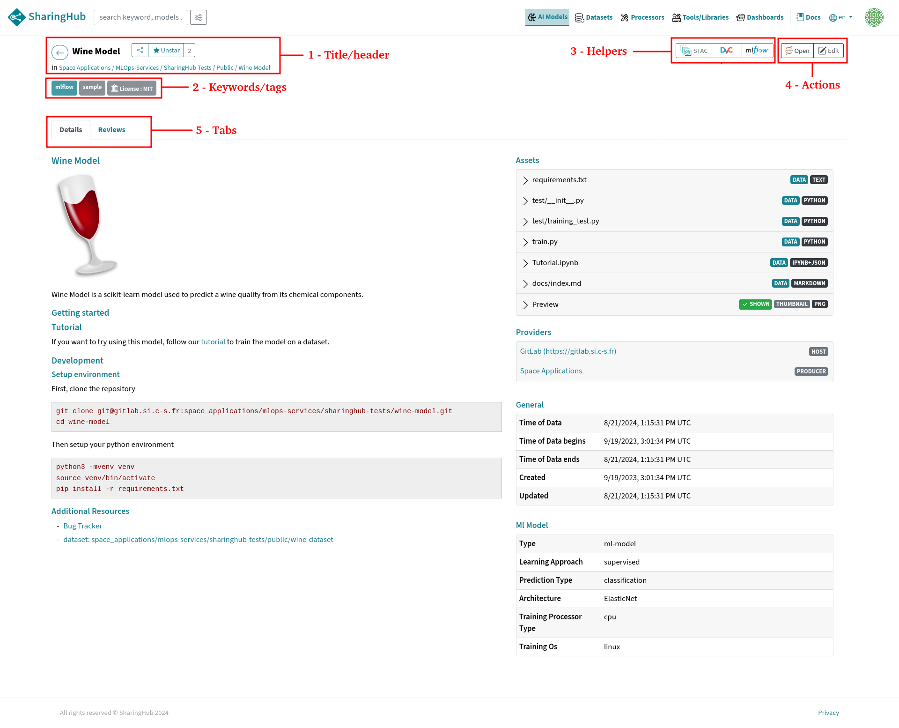

## 1. Title/Header

This section is made up of the project's name as described in GitLab and a link that takes you directly to the repository where the project is hosted. You can also find the share and start buttons.

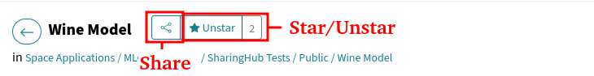

## 2. Keywords/Tags

This section displays all the keywords and licenses related to the project in GitLab. It's important because it's used as a label to filter out projects with common criteria or specifications. Moreover, tags are used to improve searches, as described in the [tag search section](./search.md#tag-search-tab).

## 3. Helpers

This group of buttons are helpers.

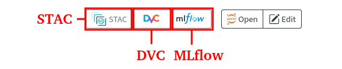

### STAC

The STAC helper display download code with the STAC API by using Python `requests` and EODAG, as well as STAC informations.

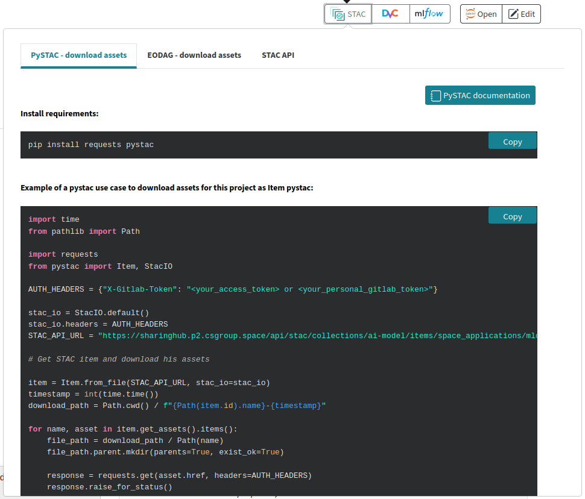

### DVC

The DVC button displays configuration and setup of DVC for the project.
The DVC service enables you to store large volumes of data. The DVC button is therefore only displayed for projects in the "Datasets" category, which have a DVC configuration in the source GitLab project. This button displays the remote DVC configuration link and additional information on the DVC [documentation](https://dvc.org/doc) and [tutorial](../tutorials/dataset_with_dvc.md).

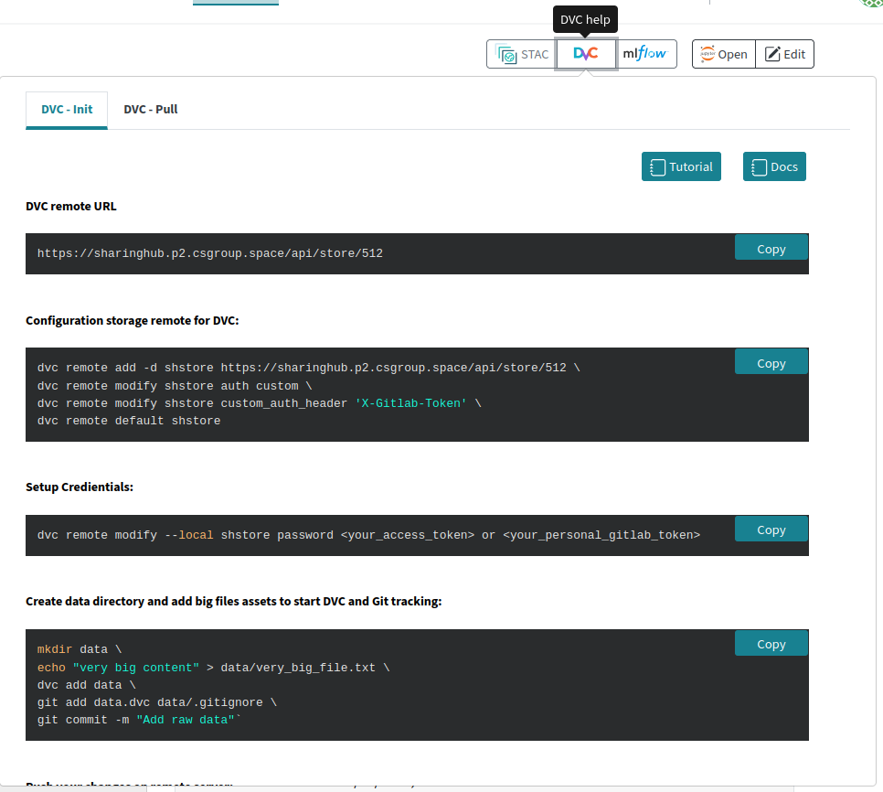

### MLflow

The MLflow helper shows MLflow basic code setup with autolog feature, and display a button to go to the MLflow web interface.

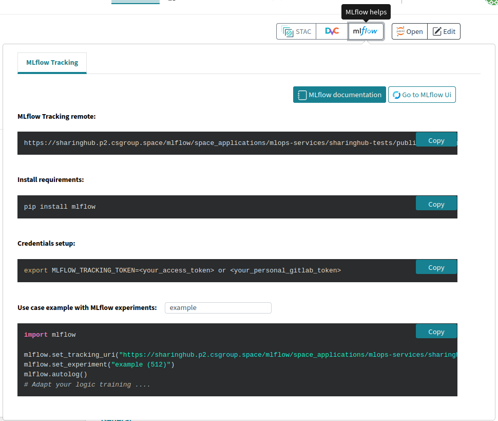

## 4. Action buttons

The actions buttons are divided in 2 groups. On the left are helpers, on the right features.

### Edit project

Open embedded GitLab code editor to edit the project.

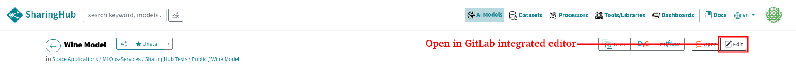

Clicking will open a new tab:

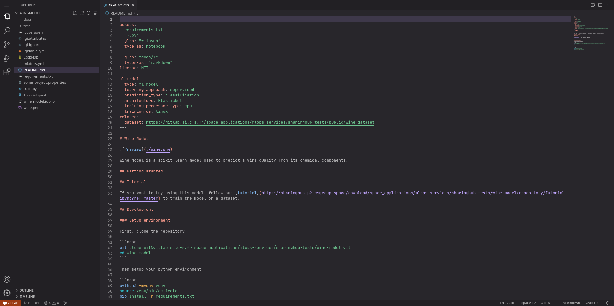

### Open in Jupyter

If the SharingHub is configured with a notebook service, this button will appear, allowing you to open the project, in particular your AI model in a notebook, for testing or manipulation in a dedicated environment.

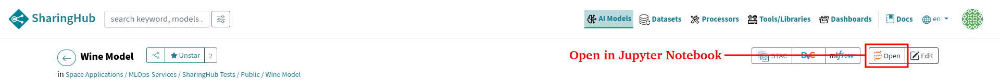

When you click the open button, the Jupyter environment is launched to open the target Notebook.
Click on the "Launch Server" button.
At next page, select "vreot-cloud" environment and click on "Start" button.

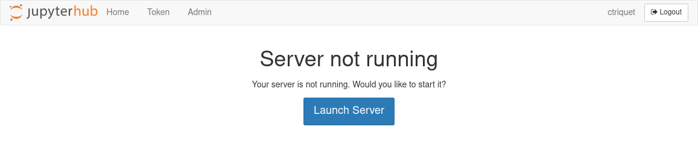

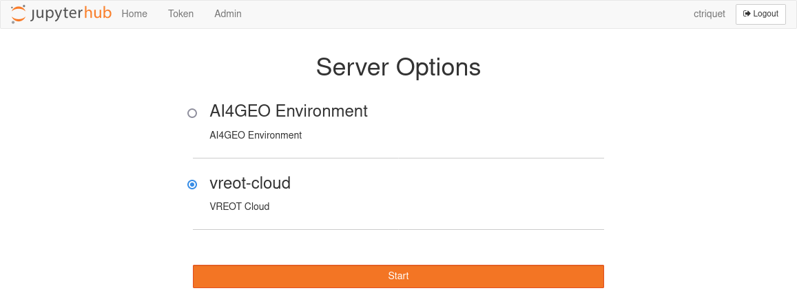

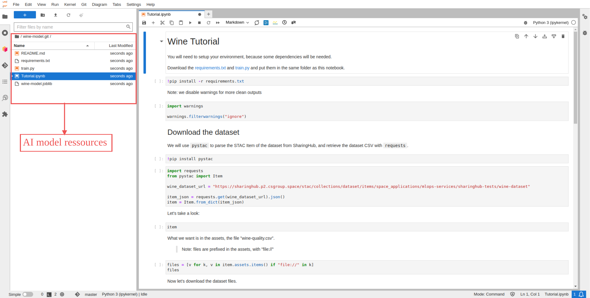

!!! info
    **_Configure destination folder_**

    The project is cloned by default in your Jupyter environment home folder.
    If you prefer to customize that behaviour, it is required to set an environment variable into Jupyter.
    To do so, you have to initialize a user Jupyter configuration file.
    Into Jupyter, open a terminal and execute:

    ```bash
    jupyter notebook --generate-config
    vim ~/.jupyter/jupyter_notebook_config.py
    ```

    and add into that file:

    ```python
    import os
    os.environ["NBGITPULLER_PARENTPATH"] = "destination_folder"
    ```

    with "destination_folder" the relative path from your home folder where you want projects to be cloned.

    Finally, restart Jupyter for that configuration to be applied.

## 5. Tabs

The tabs allow to switch between multiple views.

### Details Tab

This "details" tab displays the project description first. This view highlights all the project's files and resources in the "assets" section, and thanks to the "additional resources" section it's possible to see references to other projects or resources.

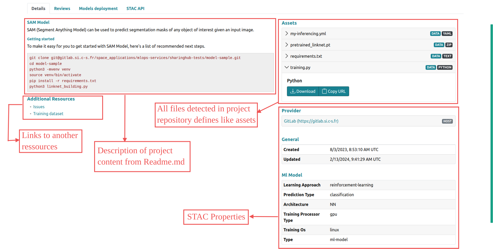

In some cases, and more generally for datasets, the details tab may show a map with an area corresponding to the geographic extent of the dataset.


### Reviews Tab

This section is a discussion forum for the project, allowing contributors to leave notes and ask questions to each other.

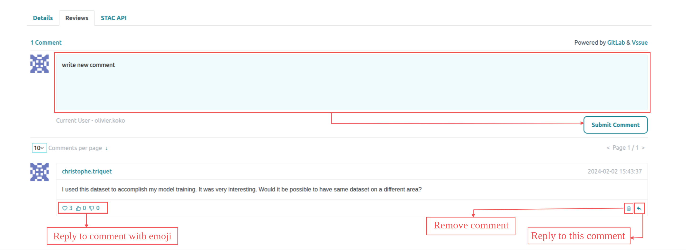
