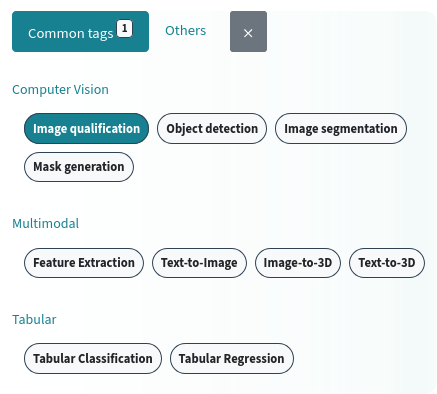
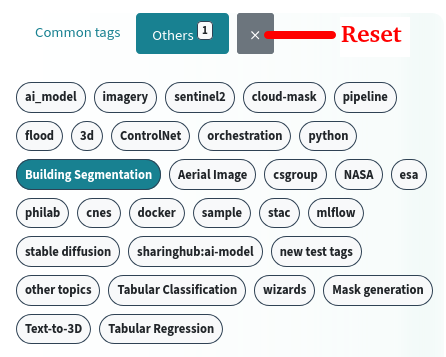
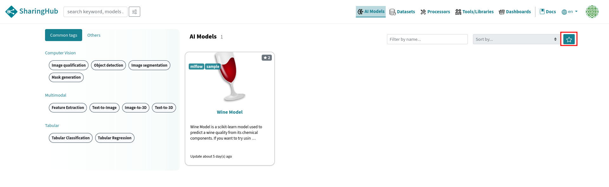

# Search

SharingHub is a platform with _your_ AI models, Datasets, Processors, Tools/Libraries, and Dashboards.

Everything you need for your Machine Learning projects is accessible through SharingHub which provides several search features.

## Tag search tab

In the category view, it's possible to search for projects by specific tag to target your search.
There are two types of tags: **common tags**, which refers to the most commonly used tags in the field, and **other tags**, which refers to tags associated with projects in the GitLab connected to SharingHub.

| Common | Other |
|---|---|
|  |  |

## Filter by title

The search by title field allows you to dynamically filter projects in the current category page.

## Filter by starred projects

The star button allows to filter only projects you have starred. Projects of any categories can be starred independently on SharingHub or GitLab and this status will be automatically synchronized between both.

Click on the button again to deactivate this filtering.

## Sort items

In addition to filtering, it is also possible to sort results to optimize visualization. The following criteria are available for filtering:

- Recently created projects,
- Recently modified projects,
- Most popular projects (by number of likes).
- You can also sort them in ascending alphabetical order to facilitate your search.

## Search Anywhere

## Advanced Search

Sometimes, you may want to perform complex or more precise searches. The "advanced search" view provides a richer interface for your searches.

