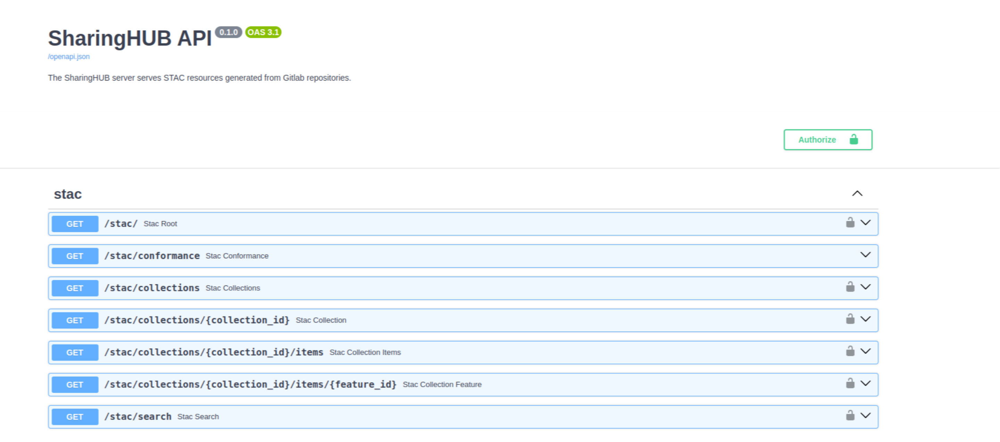

# STAC API

All projects on SharingHub are available in STAC format as Collection, FeatureCollection or FeatureItem, thanks to the STAC API.
In other words, it is possible to interact with the SharingHub using other STAC clients such as EODAG, QGIS STAC etc... You will find a list of clients [here](https://stacspec.org/en/about/tools-resources/#Visualization).
