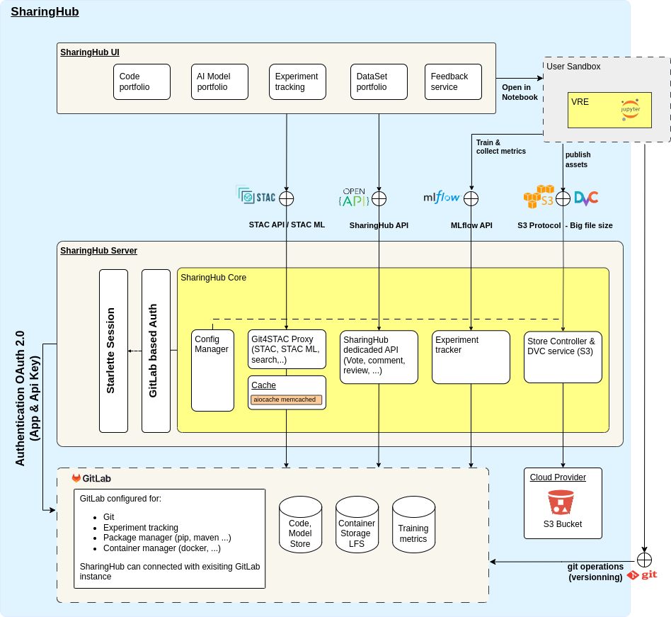

# Architecture

## Philosophy

SharingHub offers collaborative services for managing code, datasets, and AI models,
emphasizing the importance of sharing and collaboration to enhance efficiency, quality, and reuse within EO platform ecosystems.
It integrates features like code and model ranking, peer reviews, full lifecycle support, and asset discovery.

**Key features include**:

- **Lifecycle Management**: Tools and functionalities for managing the entire lifecycle of software packages, AI models, workflows,
and services, from development and testing to deployment.

- **Source Code and Asset Management**: Storage and management of source code, assets, and applications created and published by users.

- **Ranking and Peer Review**: Interfaces for ranking algorithms, software packages, datasets, and AI models.
The peer review process allows thorough evaluation and feedback, ensuring code quality and preventing unstable code from shipping.

SharingHub aligns with GitLab CE provide a robust infrastructure, which includes ML/AI lifecycle management capabilities through
MLflow integration.

To address this, our solution extends GitLab with a dedicated web portal customized for researchers, data scientists, and AI analysts.

This extension provides:

- **User-Friendly Interfaces**: Specialized tools and interfaces for presenting services, AI models, datasets,
and their interconnections in a scientific manner.

- **Focused Development**: Enables AI researchers to concentrate on developing AI models and algorithms while benefiting
from GitLab's collaborative, version control features and MLflow service for AI models training.

## SharingHub Architecture

SharingHub architecture is organized into three main components:

- **SharingHub UI**:

The "SharingHub UI" is the main entry point. It takes the form of a web portal specially developed to make it easy to discover, browse,
review and download services, code, AI models and datasets.
It dynamically extracts the information stored by users and present it in the best possible way once it has been developed/improved.

- **SharingHub Server**:

The "SharingHub Server" is the engine that support all the intelligence that enables the portal to carry out its operations.
Its aim is to provide interoperable interfaces that can also be used by external tools, which can then interface with models,
datasets and metrics managed. Thus, the portal backend acts like an enhanced SpatioTemporal Asset Catalog (STAC) that dynamically creates
its content structure from assets stored in different Git repositories. It serves as a bridge between the Git repositories and the STAC
format, enabling users to browse and access datasets within a fully functional STAC structure.

- **GitLab Instance**:

A "GitLab" instantiation, including activated "MLflow" service, is specifically configured to meet the needs of users,
whether they are developers, AI scientists, or service providers.
All the functionalities of GitLab are retained (Git, DevOps, issue management, code review, etc.), making this component usable
throughout the development, deployment, and maintenance lifecycle of projects and services to implement best development practices,
manage test execution, perform continuous integration, ensure traceability, and reproducibility.

<figure markdown="span">
  
  <figcaption>SharingHub Architecture</figcaption>
</figure>
