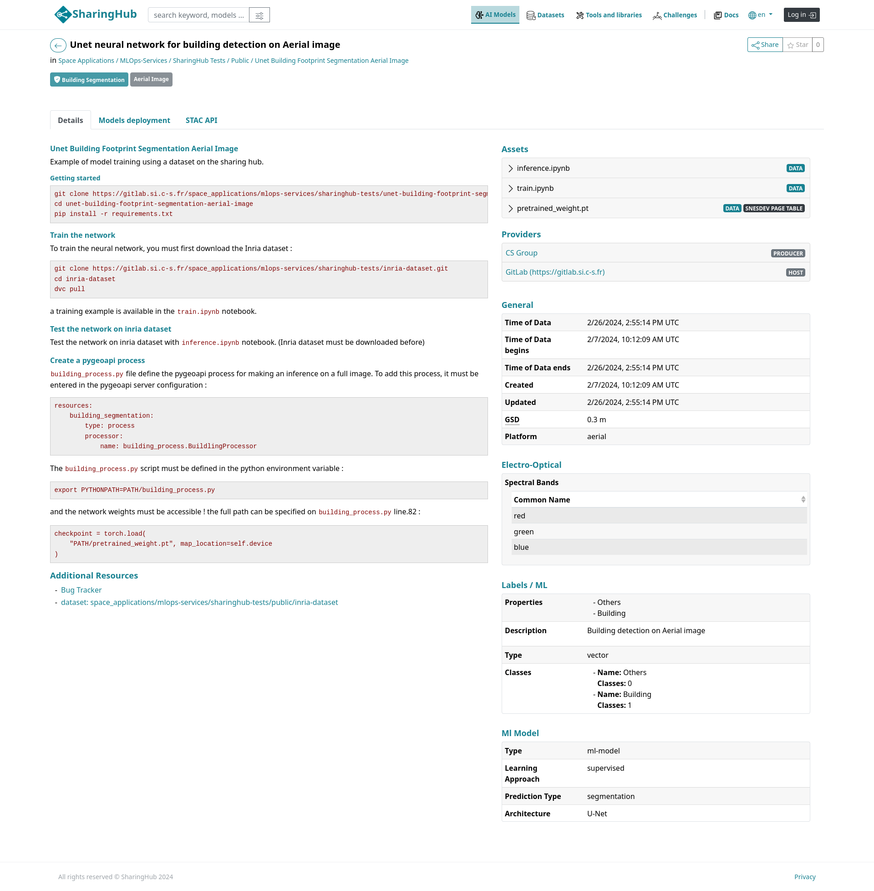
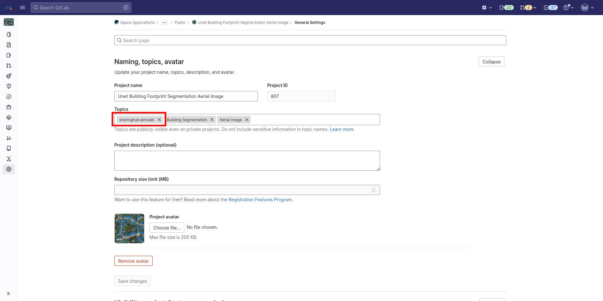

# Case: AI Model

We will study the case of a model used for building detection on Aerial image.



## Configuration

To share your artificial intelligence model on the SharingHub, you need to set up your GitLab repository to include the topics `sharinghub:aimodel` from Settings and General:



To make your model usable by others, you need to create a `README.md` file. This file should begin with a YAML section describing your model's metadata, followed by a markdown section:

- The markdown part of your README must contain all the elements needed to train and/or make an inference with your AI model!
- The YAML section is delimited by three `---` at the top of your file and at the end of the section. It contains the metadata presented in the \[[Reference](../metadata/reference.md)].

## Structure

The repository tree:

```txt
.
├── building_process.py
├── inference.ipynb
├── pretrained_weight.pt
├── README.md
├── requirements.txt
└── train.ipynb
```

## Metadata

Here's the project metadata:

```yaml title="README.md Metadata"
title: Unet neural network for building detection on Aerial image

related:
  dataset: https://gitlab.example.com/<dataset-project-repository>

assets:
- "*.ipynb"
- "*.pt"

gsd: 0.3
platform: aerial

providers:
  - name: CS Group
    roles: ["producer"]
    url: https://www.csgroup.eu

label:
    properties: ["Others", "Building"]
    description: "Building detection on Aerial image"
    type: "vector"
    classes: [
        {
            "name": "Others",
            "classes":  [0]
        },
        {
            "name": "Building",
            "classes": [1]
        }
    ]

ml-model:
    type: "ml-model"
    learning_approach: "supervised"
    prediction_type: "segmentation"
    architecture: "U-Net"
```

Let’s break down the project's metadata.

- `title`: override the default title, which is the name of the GitLab project "Unet Building Footprint Segmentation Aerial Image". [[Ref](../metadata/reference.md#title)]
- `assets`: define the files in the repository that we want to share with SharingHub. [[Ref](../metadata/reference.md#assets)]
- `gsd` and `platform` are pure STAC properties. [[Ref](../metadata/reference.md#remaining-properties)]
- `providers`: override the default providers. [[Ref](../metadata/reference.md#providers)]
- `label` and `ml-model` are STAC extensions. Our model here uses the adapted STAC extensions with its use-case, [label](https://github.com/stac-extensions/label) and [ml-model](https://github.com/stac-extensions/ml-model). [[Ref](../metadata/reference.md#extensions)]
