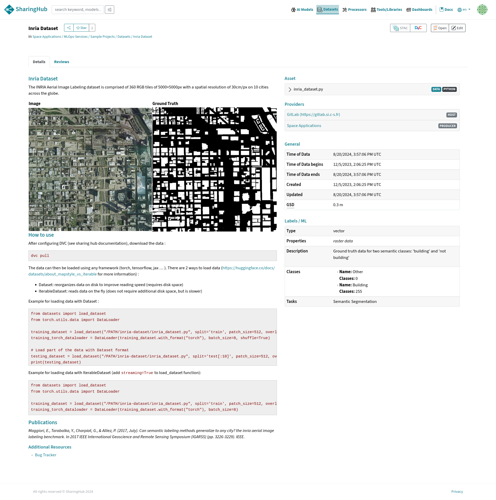
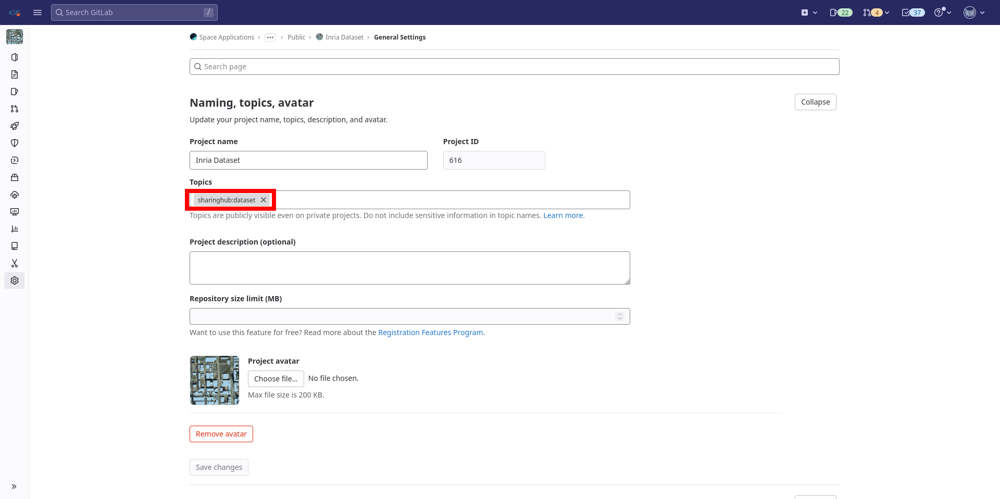

# Case: Dataset

The INRIA Aerial Image Labeling dataset is comprised of 360 RGB tiles of 5000×5000px with a spatial resolution of 30cm/px on 10 cities across the globe.



## Configuration

To share your dataset on the SharingHub, you need to set up your GitLab repository to include the topics `sharinghub:dataset` from Settings and General:



To make your dataset usable by others, you need to create a `README.md` file. This file should begin with a YAML section describing your dataset's metadata, followed by a markdown section:

- The markdown part of your README must contain all useful information about the dataset: how to use it and in what context, how it was created etc...
- The YAML section is delimited by three `---` at the top of your file and at the end of the section. It contains the metadata presented in the \[[Reference](./reference.md)].

## Structure

The repository tree:

```txt
.
├── data
│   ├── test
│   │   ├── gt.dvc
│   │   └── img.dvc
│   ├── train.dvc
│   └── validation.dvc
├── inria_dataset.py
├── README.md
├── requirements.txt
└── samples
    ├── ground_truth.png
    └── image.png
```

You may notice the "dvc" extensions, this is because we use [DVC](../data/dvc.md) to store the files. Learn more in the tutorial ["Manage large dataset with DVC"](../../tutorials/manage_dataset_with_dvc.md).

## Metadata

Here's the project metadata:

```yaml title="README.md Metadata"
assets:
- "*.zip"
- "*.py"

gsd: 0.3

label:
  type: vector
  properties: null
  description: "Ground truth data for two semantic classes: 'building' and 'not building'"
  classes:
    - name: Other
      classes: [0]
    - name: Building
      classes: [255]
  tasks:
    - Semantic Segmentation
```

Let’s break down the project's metadata.

- `assets`: define the files in the repository that we want to share with SharingHub. [[Ref](./reference.md#assets)]
- `gsd`: pure STAC property. [[Ref](./reference.md#remaining-properties)]
- `label`: a [STAC extension](https://github.com/stac-extensions/label), adapted to the dataset use-case. [[Ref](./reference.md#extensions)]
