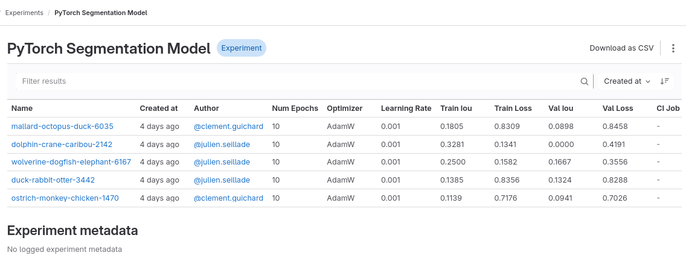

# :simple-gitlab: GitLab Integration

Introduced in GitLab `15.11`, and generally available in GitLab `16.1`, ["Machine learning model experiments"](https://docs.gitlab.com/ee/user/project/ml/experiment_tracking/) allows users to track experiments directly in their GitLab project (under `Project (sidebar) > Analyze > Model Experiments`), as close as possible to your model code. This feature is relatively new, and is still receiving important feature requests for improvement. On another note, that also means that right now some tooling may be missing when using it.

<figure markdown="span">
  
  <figcaption>GitLab Experiments</figcaption>
</figure>

The important feature is the MLflow compatibility. That means you can use MLflow to push to GitLab as a tracking URI. You can learn more in the [MLflow client compatibility](https://docs.gitlab.com/ee/user/project/ml/experiment_tracking/mlflow_client.html) documentation.

!!! note
    An important thing to note is that your SharingHub may be configured with GitLab integration, and the code generator in the [MLflow helper](../../explore/project-view.md#mlflow) will use GitLab as a tracking URI in the snippets generated. Be sure to check this helper!
