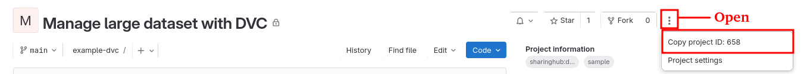

# Manage large dataset with DVC

## Introduction

The management of large amounts of data is achieved through integration with DVC.
Data Version Control (DVC) lets you capture the versions of your data and models in Git commits, while storing them on-premises or in cloud storage. The result is a single history for data, code, and ML models that you can traverse — a proper journal of your work!

The DVC integration offered by SharingHub enables protected, high-performance access to data, while respecting the management of data access rights carried out on GitLab, making it the central point for information management.

## Get Started with DVC

### Prerequisites

As a prerequisite for using DVC, you must have a Git repository initialized:

```bash
mkdir example-dvc
cd example-dvc
git init
git remote add origin https://a:<your_personal_gitlab_token>@gitlab.example.com/<project_path>
```

!!! note
    You don't have to initially create your project in GitLab before executing these commands; these commands and next bellow will do it for you.

### Initializing DVC with SharingHub

Inside your chosen directory, we will use our current working directory as a DVC project. Let's initialize it by running dvc init inside a Git project:

```bash
dvc init
git commit -m "Initialize DVC"
```

The following command will push the modifications into GitLab, create the project if necessary, and initialize rights management in SharingHub.

```bash
git push --set-upstream origin main
```

You can now retrieve the project's unique identifier (`<project_id>`) by connecting to the GitLab interface via the URL `https://gitlab.example.com/<project_path>`.



This id is necessary to identify the storage path for DVC, so you can continue the configuration.

```bash
dvc remote add -d shstore https://sharinghub.example.com/api/store/<project_id>
dvc remote modify shstore auth custom
dvc remote modify shstore custom_auth_header 'X-Gitlab-Token'
dvc remote default shstore
git push
```

### Authenticate DVC with SharingHub

Configure your authentication (will be only stored locally)

```bash
dvc remote modify --local shstore password <your_personal_gitlab_token>
```

### Tracking data as usual

Working inside an initialized project directory, let's pick a piece of data to work with. We'll use an example `very_big_file.txt` file, in the `data` directory.

```bash
mkdir data
echo "very big content" > data/very_big_file.txt
```

Use `dvc add` to start tracking the dataset file:

```bash
dvc add data/very_big_file.txt
```

DVC stores information about the added file in a special `.dvc` file named `data/very_big_file.txt.dvc`. This small, human-readable metadata file acts as a placeholder for the original data for the purpose of Git tracking.

Next, run the following commands to track changes in Git:

```bash
git add data/very_big_file.txt.dvc data/.gitignore
git commit -m "Add raw data"
dvc push
git push
```

You can also directly add a complete directory:

```bash
git add data/directory
git commit -m "Add a directory"
dvc push
git push
```

### Retrieving data

To retrieve the managed data:

* clone the GIT project
* configure authentication as described in the section `Authenticate DVC with SharingHub`.
* and download the data through `dvc pull`.

```bash
git clone https://gitlab.example.com/<project_path>
cd example-dvc
dvc remote modify --local shstore password <your_personal_gitlab_token>
dvc pull
```
